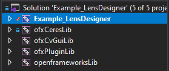
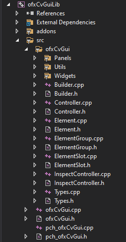
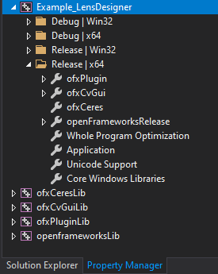

# Introduction

ofxAddonLib introduces a new pattern for working with addons in Visual Studio. It involves:

1. The addon has a a `.vcxproj` file which contains all the `cpp` and `h` files. This project can then be included in your solution like `openFrameworks` is.
2. The addon may also have a `.props` file which can be added to your project to apply project settings

This has a number of advantages:

1. If an addon changes, you don't need to recreate any projects which reference it
2. Build times can be quicker if you have multiple apps using the same addons as you don't need to rebuild the addon for each project (you're simply linking it).
3. Addon developers can add complex build settings to their addons which might not be supported by projectGenerator

Disadvantages:

1. ofxAddonLib pattern is not supported by projectGenerator, so you'll have to add the addons manually
2. Only supported by Visual Studio

# What does this look like?

In the Solution Explorer, you have one or more addons as seperate projects:



Those addons can contain all their own files. If the addon changes, then it will be automatically updated across all of the solutions which include that addon.



In the `Property Manager` (note : this isn't the Solution Explorer) we have a property sheet for each addon. These apply things like include paths, libraries and other project settings.



# How to use an addon which uses ofxAddonLib pattern

1. In the `Solution Explorer`, right click on your solution and select `Add>Existing Project...` and choose the addon's project (e.g. `addons\ofxCvGui\ofxCvGuiLib\ofxCvGui.vcxproj`)
2. In the `Property Manager` (open it from `View>Other Windows>Property Manager`), right click on your project to select `Add Existing Property Sheet...` and select the props file, e,g, `addons\ofxCvGui\ofxCvGuiLib\ofxCvGui.props`
3. In the `Solution Explorer`, right click on your project and select `Add Reference...`, and add a reference to the addon project, e.g. `ofxCvGui`.

# What is this repo?

1. Some shared files used by addons that use the ofxAddonLib pattern
2. These instructions

Not all addons that use the ofxAddonLib pattern require this addon, especially where we want to make it easy for users (e.g. ofxKinectForWindows2). Annoyingly, if an addon requires this addon to exist and it isn't installed, the error given by VS isn't very clear (sorry about that!). Ideally we could put most of this into openFrameworks proper.


# Tricky caveats

## Moving applications out of addon example folders

For applications inside addon folders (e.g. examples), Visual Studio will often store paths relatively inside the project and solution files. You may need to edit these yourself if you move the addon, for example:

### simpleExample.sln
```
Project("{8BC9CEB8-8B4A-11D0-8D11-00A0C91BC942}") = "ofxSquashLib", "..\ofxSquashLib\ofxSquashLib.vcxproj", "{FAA73572-FD12-41FA-8FBE-CB47482D2D87}"
```
needs to be changed to
```
Project("{8BC9CEB8-8B4A-11D0-8D11-00A0C91BC942}") = "ofxSquashLib", "..\..\..\addons\ofxSquash\ofxSquashLib\ofxSquashLib.vcxproj", "{FAA73572-FD12-41FA-8FBE-CB47482D2D87}"
```

### simpleExample.vcxproj
```
    <Import Project="..\ofxSquashLib\ofxSquash.props" />
```
needs to be changed to
```
    <Import Project="..\..\..\addons\ofxSquash\ofxSquashLib\ofxSquash.props" />
```
Often you need to change this 4 times in the file (`Debug|x64`, `Release|x64`, `Debug|Win32`, `Release|Win32`)


also...
```
    <ProjectReference Include="..\ofxSquashLib\ofxSquashLib.vcxproj">
```
needs to be changed to
```
    <ProjectReference Include="..\..\..\addons\ofxSquash\ofxSquashLib\ofxSquashLib.vcxproj">
```


# Notes

This property sheet should be above the openframeworksDebug.props / openframeworksRelease.props (we want to cancel out the Post-Build Event to xcopy the dll's into the Target App folder, and above means evaluated later).
